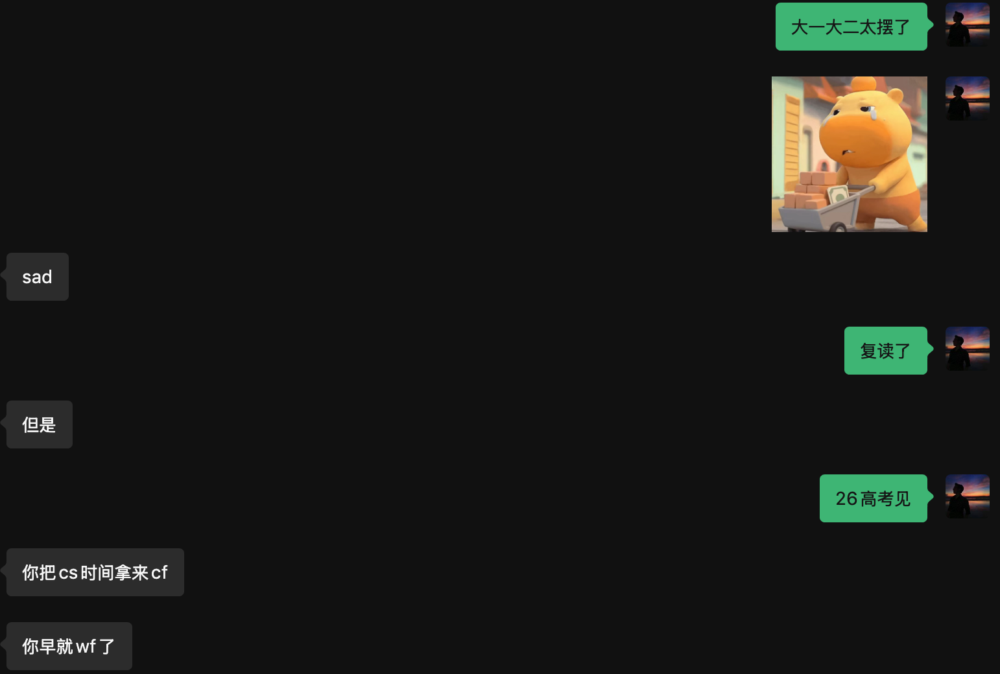

## 前言

在高中OI竞赛集训时期其实一直有记录的习惯，那时候感觉还是有一些帮助。高考后也有用[34枚金币时间管理法](https://zhuanlan.zhihu.com/p/36063372)记录时间的习惯，到现在已经坚持记录了两年多。不过回头看，感觉缺少了反思和总结，而且记录的内容有时候也不是很客观。 希望现在重新开始写周记，能够更加客观的总结和回顾每一周的学习和生活吧。

去年来美国后的时候也维护了一个blog，但是换电脑后不小心把它给搞爆了，刚好今天重新搭好了一个新的blog，并且把之前的内容重新搬过来了，也算是新的开始吧。

上一篇blog居然已经是五月份的事情了 sad 😢

暑假的实习总结之后有空再补（flag？）

## 学习 && 科研

上周五考完 Machine Architecture and Organization 的midterm，打破了我来美国后所有专业课midterm 都满分的记录 (悲)

这周学习状态有些松懈，尝试重新开始学习科研（RL + MLLM 炒作进行中），也在补学 non-linear optimization 的内容(感觉再不学midterm要爆了)。还有一万个DDL要肝，选四门研究生课加一门专业课的workload确实有些大。btw， 这个运筹学的model怎么跑的这么慢啊，差点速通失败了。

意识到周六需要打ICPC NAQ预选赛，虽然裸考进校一队也没啥压力，但几个月没写 c++ 和算法还是有点慌张。

## 竞赛

vp了一场codeforces div2，居然进前10了！回光返照了属于是，突然感觉自己有点稳，又开始松懈了，开始折腾搭这个blog，打CS2 和看比赛了(Vitality王朝了😋)

然后周六差点被一脚踢死（雾）

不训练是这样：

今年NAQ的组织真是一言难尽，网怎么这么差qwq

今年得用学校cse-lab的电脑，发现自己不会用，折腾了一会才弄明白。

比赛刚开始发现网站炸了，开赛50分钟的时候我才进去一下网站，秒了第一题，然后网站又炸了。 1.5h的时候再进去，发现有个同校选手已经写了五题了，麻了，然后开始非常缓慢的写。

封榜前发现自己稳前三了，被罚时干爆了，剩两题，一题感觉会了，但是被开场的巨大劣势搞得不想写了，于是乎最后一个小时开始到处盒别的学校的朋友。发现了好多个认识的人，然后发现今年强度巨大，吓晕了。

赛后确实也有惊无险(?)进入了校一队，被队友爆杀了。

去年rank 1，今年差点被一脚踢死，也挺难绷的

赛后混入了 Wisc 的 icpc 交流群，怎么这么多老钟，我是精神 Wisc 人！

后面有时间补一下剩下的题，还有写个题解，但是明天还有5个ddl，得肝完先😭

## 日常生活

开学一个月非常焦虑，总是感觉自己大一大二浪费了太多时间，啥也没学到。

有些后悔之前做的一些决定，也经常幻想如果能重新开始该多好。

因为焦虑导致作息混乱，每天都想摆烂，经常报复性打一晚上游戏，或者干一些没啥意义的事情。

但是比起上周已经好一些了。

周日和朋友一起去吃了自助火锅😋，之后一起在附近转了一下午，非常快乐。

大家聊了很多，收获了许多新的想法，也发现每个人都有自己的烦恼，不止我一个人这么焦虑。

人毕竟从基因上来讲是群居动物，多和别人交流，多融入群体，对于身心健康还是有帮助的。

## 总结

总的来说，这周比上周要好些了，至少是在往好的方向发展。
希望能保持这个势头吧。

得开始认真做时间规划了，不然在科研，学习，竞赛，找工这几件事的压力下真的很容易崩。

简单立一下下周的flag：

- 重新开始健身，保持身体健康
- 继续读上次读一半的书
- 每天安排1-2小时给research
- 每天安排2小时给icpc竞赛(怎么三周后就区预赛了啊啊啊啊啊)
- 追上optimization还有Operation Research的课程进度，补天坑
- 更新简历，继续投26 summer 实习